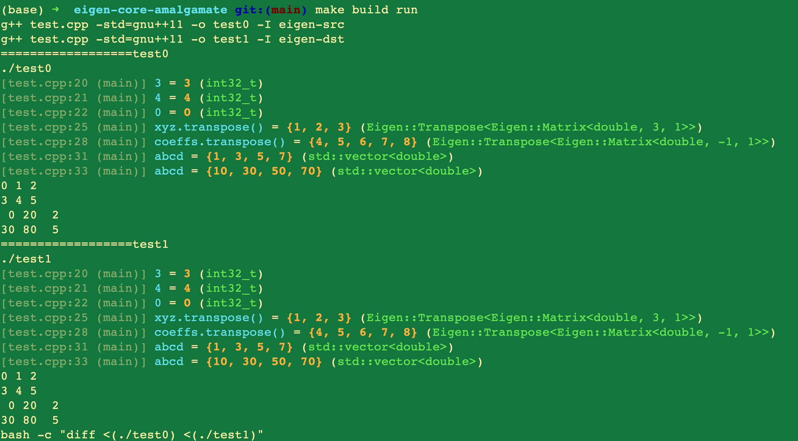

# eigen-core-amalgamate

>   For minimal c++ programs that needs a
>   [pybind11](https://github.com/pybind/pybind11/blob/master/include/pybind11/eigen/matrix.h)/numpy
>   binding.

Amalgamated Eigen headers:

-   `Eigen/Core`: [source](eigen-src/Eigen/Core) -> [amalgamated](eigen-dst/Eigen/Core)
-   `Eigen/SparseCore`: [source](eigen-src/Eigen/Sparse) -> [amalgamated](eigen-dst/Eigen/SparseCore)

Test: `make build test`

Related:

-   https://sqlite.org/amalgamation.html
-   https://github.com/edlund/amalgamate
